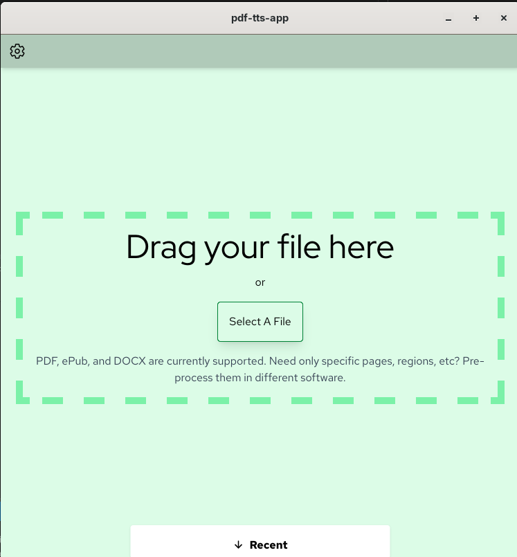

# PDF-TTS-APP
Simple Tauri app that uses sherpa to create a text-to-speech of whatever pdf you send it. Made with Sherpa, Solid.js, and Tauri.

## TTS Model Support
Currently, this project is hardcoded only to support models like so:

- `vits-piper-en_US-libritts_r-medium`
    - `espeak-ng-data`
    - `en_US-libritts_r-medium.onnx`
    - `en_US-libritts_r-medium.onnx.json`
    - `MODEL_CARD`
    - `tokens.txt`
    